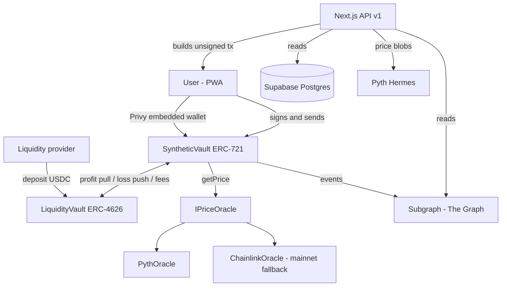
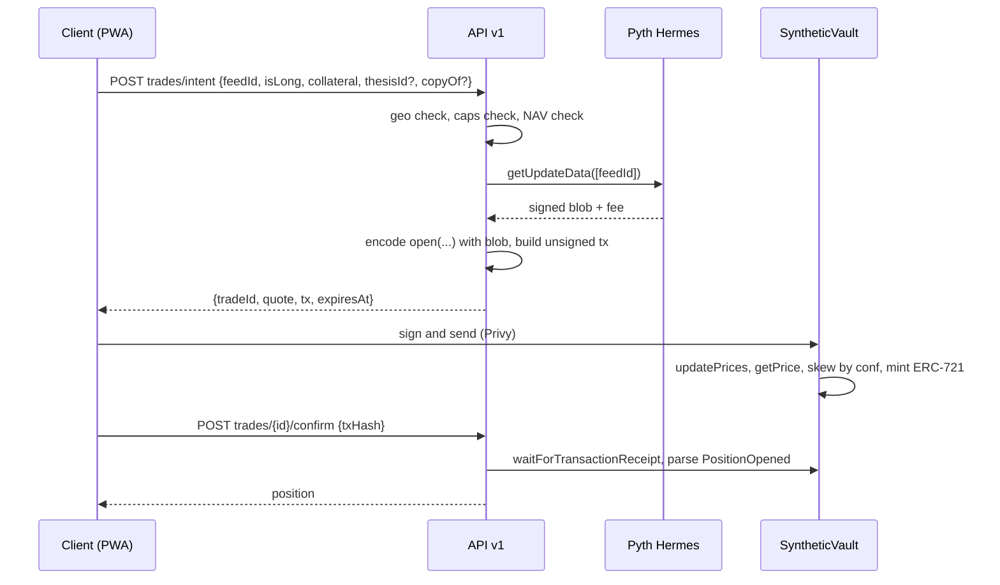

# Cope Market — Architecture

Companion to `PLAN.md`. This document specifies the on-chain contracts, the math and invariants they
enforce, the off-chain services, the data model, the API contract, and the threat model.

**Target chain:** Arc (testnet `5042002` during development, mainnet `5042` from Sept 16).
**Collateral and gas:** USDC.

---

## 1. System overview

Cope Market is a social feed on top of a synthetic trading venue. Users post event-driven theses
backed by real positions; a USDC pool supplied by LPs is the counterparty to every position; prices
come from Pyth; copy attribution and author profit-share settle on-chain.



**Division of responsibility**

| Concern | Owner |
|---|---|
| Money, price, position state, settlement | Contracts on Arc |
| Social content: theses, tweets, comments, follows | Postgres |
| Derived read models: P&L, leaderboard, copy lineage | Subgraph |
| Transaction construction, auth, validation | Next.js API |
| Signing | Privy embedded wallet, client side only |

The database never holds authoritative financial state. If Postgres is wiped, every position, every
balance and every copy relationship survives on-chain.

---

## 2. On-chain

### 2.1 Contract map

```
contracts/
  SyntheticVault.sol      ERC-721. Positions, open/close/liquidate, copy attribution.
  LiquidityVault.sol      ERC-4626. LP capital, NAV, payouts to the synthetic vault.
  oracle/
    IPriceOracle.sol      Interface used by the vault.
    PythOracle.sol        Pull model. Primary.
    ChainlinkOracle.sol   Push model. Mainnet fallback.
    MockOracle.sol        Tests only.
  libraries/
    Math.sol              Fixed-point helpers, 1e18 internals.
```

Three deployed contracts plus an oracle adapter. Two token standards, each used for what it is
actually for: fungible ERC-4626 shares for LP capital, non-fungible ERC-721 for positions.

### 2.2 Oracle interface

```solidity
interface IPriceOracle {
    struct Price {
        uint256 price;       // 1e18, USD
        uint256 conf;        // 1e18, confidence interval
        uint64  publishTime;
    }

    /// @notice Reverts if the price is older than maxAge or confidence is too wide.
    function getPrice(bytes32 feedId, uint256 maxAge) external view returns (Price memory);

    /// @notice Fee required by updatePrices for this payload. Zero for push oracles.
    function updateFee(bytes[] calldata updateData) external view returns (uint256);

    /// @notice Posts fresh price data. No-op for push oracles.
    function updatePrices(bytes[] calldata updateData) external payable;
}
```

`PythOracle` wraps `IPyth`, normalising Pyth's `(price, expo)` pair to 1e18 and passing `conf`
through. `ChainlinkOracle` reads `latestRoundData()`, ignores `updateData`, and returns a configured
static confidence in basis points because Chainlink publishes no confidence interval.

Keeping this behind one interface is what makes the Pyth-to-Chainlink switch a deployment argument
rather than a rewrite — which matters because Pyth is confirmed on Arc **testnet** while Chainlink
is confirmed on Arc **mainnet**.

### 2.3 SyntheticVault

```solidity
contract SyntheticVault is ERC721 {

    struct Position {
        bytes32 feedId;        // Pyth price feed id
        bool    isLong;
        uint64  openedAt;
        uint128 collateral;    // USDC, 6 decimals
        uint256 units;         // 1e18, quantity of the synthetic asset
        uint256 entryPrice;    // 1e18, USD, already skewed against the user
        uint256 copiedFromId;  // origin tokenId for lineage; 0 if original
        address copyAuthor;    // snapshot: who receives the author fee; address(0) if original
        uint16  authorFeeBps;  // snapshot of the rate at copy time
    }

    struct AssetConfig {
        bool    enabled;
        uint32  maxAgeSec;       // staleness bound
        uint32  maxConfBps;      // reject if conf/price exceeds this
        uint32  openFeeBps;
        uint32  closeFeeBps;
        uint128 maxOiUsd;        // per side, 1e18
        uint128 maxPositionUsd;  // per position, 1e18
    }

    struct AssetState {
        uint256 longUnits;   uint256 longAvgEntry;
        uint256 shortUnits;  uint256 shortAvgEntry;
    }

    function open(
        bytes32 feedId,
        bool    isLong,
        uint128 collateral,
        uint256 copiedFromId,
        bytes[] calldata updateData
    ) external payable returns (uint256 tokenId);

    function close(uint256 tokenId, bytes[] calldata updateData) external payable;

    function liquidate(uint256 tokenId, bytes[] calldata updateData) external payable;

    /// @notice UI preview. No state change, no update posting.
    function quote(bytes32 feedId, bool isLong, uint128 collateral)
        external view returns (uint256 entryPrice, uint256 units, uint256 fee);

    /// @notice Vault's net obligation across all open positions for one asset. Positive = owed.
    function liability(bytes32 feedId) external view returns (int256);
}
```

**Why ERC-721 and not ERC-20.** Positions carry their own entry price, so they are not fungible: an
AAPL long opened at $220 and one opened at $240 are different instruments. Forcing ERC-20 means
pooling holders at one shared average entry, which is the tracker-share design — and that loses both
shorts and per-user P&L. ERC-721 keeps per-position accounting and gains transferability and
composability for free. Uniswap v3 LP positions use the same pattern.

**Author versus owner.** `copyAuthor` is stored on the copying position as a snapshot at open time.
Payout on close goes to `ownerOf(tokenId)` — the current holder, which may have changed — while the
author fee goes to the snapshotted `copyAuthor`. The two must never be conflated. Snapshotting also
means the fee survives the origin position being closed and burned.

### 2.4 LiquidityVault

```solidity
contract LiquidityVault is ERC4626 {   // asset = USDC

    /// @notice USDC held, less what the synthetic vault currently owes open positions.
    function totalAssets() public view override returns (uint256) {
        int256 nav = int256(usdc.balanceOf(address(this)));
        bytes32[] memory feeds = vault.enabledFeeds();
        for (uint256 i; i < feeds.length; ++i) {
            nav -= vault.liability(feeds[i]);      // negative liability increases NAV
        }
        return nav > 0 ? uint256(nav) : 0;
    }

    /// @notice Called by SyntheticVault to fund a winning close. Access-controlled.
    function payout(address to, uint256 amount) external onlyVault;

    /// @notice Exit fee stays with remaining LPs.
    function _exitFee(uint256 assets) internal view returns (uint256);
}
```

**The NAV trap.** If `totalAssets()` returned only the USDC balance, an LP could deposit immediately
before traders lose and withdraw immediately before traders win — free money extracted from the
other LPs. NAV must net out open obligations.

Marking every position individually is O(n) in open positions and too expensive. Instead the vault
keeps per-asset aggregates and computes liability in O(enabled assets), bounded at 10–20 feeds. This
is the GMX v1 approach.

**Capital layout.** Trader collateral sits in `SyntheticVault`; LP capital sits in `LiquidityVault`.
On a winning close the synthetic vault calls `payout`; on a losing close it transfers the loss to
the liquidity vault. Fees always go to the liquidity vault. Keeping the two pools separate makes the
accounting auditable and prevents trader collateral from inflating LP NAV.

### 2.5 Math

All internal arithmetic is 1e18. USDC (6 decimals) is converted only at the boundary, scaling by
`1e12`.

**Opening**

```
notionalWad = collateral * 1e12                      // 1x leverage
require(notionalWad <= cfg.maxPositionUsd)

p   = oracle.getPrice(feedId, cfg.maxAgeSec)
require(p.conf * 1e4 / p.price <= cfg.maxConfBps)

// price always moves against the user by the confidence interval
entry = isLong ? p.price + p.conf : p.price - p.conf

fee   = notionalWad * cfg.openFeeBps / 1e4
units = (notionalWad - fee) * 1e18 / entry
```

**Average entry, on open**

```
avg' = (units_existing * avg + units_new * entry) / (units_existing + units_new)
```

**Average entry, on close** — reduce units, leave the average untouched. This is standard and keeps
the aggregate consistent with per-position accounting.

**Closing**

```
p    = oracle.getPrice(feedId, cfg.maxAgeSec)
exit = isLong ? p.price - p.conf : p.price + p.conf   // against the user again

pnlWad = isLong
    ? units * (exit - entry) / 1e18
    : units * (entry - exit) / 1e18

closeFee = |pnlWad + notionalWad| * cfg.closeFeeBps / 1e4
gross    = int256(collateral) * 1e12 + pnlWad - closeFee
payout   = gross > 0 ? uint256(gross) / 1e12 : 0      // back to 6 decimals
```

**Author profit share** — only on profit, never on loss:

```
if (copyAuthor != address(0) && pnlWad > 0) {
    authorFee = uint256(pnlWad) * authorFeeBps / 1e4;
    payout   -= authorFee / 1e12;
    usdc.transfer(copyAuthor, authorFee / 1e12);
}
```

**Vault liability for one asset**

```
longPnl   = longUnits  * (px - longAvgEntry)  / 1e18
shortPnl  = shortUnits * (shortAvgEntry - px) / 1e18
liability = longPnl + shortPnl          // int256; positive = vault owes traders
```

**Liquidation** fires when loss reaches the threshold:

```
loss >= collateral * 1e12 * LIQ_THRESHOLD_BPS / 1e4      // 9000 = 90%
```

The caller receives `LIQ_REWARD_BPS` of collateral; the remainder goes to the liquidity vault; the
NFT is burned. A long at 1x cannot lose more than its collateral, so in practice this protects
against shorts, whose loss is unbounded. It runs for longs too as a safety net.

### 2.6 Invariants

These are asserted in the Foundry suite and fuzzed.

1. `sum(position.collateral for open positions) == usdc.balanceOf(SyntheticVault)`
2. `AssetState.longUnits == sum(units of open longs for that feed)`; same for shorts
3. A close never pays out more than `collateral + liability available in LiquidityVault`
4. `payout >= 0` always — a position can be wiped out, never go negative
5. `totalAssets()` is monotonically non-decreasing with respect to fees alone
6. Opening a position never increases `totalAssets()`
7. No path lets `ownerOf(tokenId)` receive the author fee, and no path lets `copyAuthor` receive the
   payout
8. 6-decimal and 1e18 quantities are never added without an explicit `1e12` scale

### 2.7 Safety controls

| Control | Where | Purpose |
|---|---|---|
| `maxAgeSec` staleness bound | contract | Blocks weekend/after-hours gap arbitrage on equity feeds. **Not optional.** |
| `maxConfBps` confidence bound | contract | Rejects trades when Pyth is uncertain |
| Confidence skew | contract | Price always moves against the user, absorbing latency drift |
| Open/close fees | contract | Must exceed typical oracle drift or latency arbitrage is profitable |
| `maxPositionUsd` | contract | Caps single-trade damage |
| `maxOiUsd` per side | contract | Caps directional exposure per asset |
| Global utilization cap | contract | Total OI as a share of LP NAV |
| Exit fee on LP redeem | contract | Removes short-term LP timing edge |
| `enabled` flag per asset | contract | Kill switch per feed |
| `geo.ts` hook | API | Returns `allowed: true` today; one-line change later |

Every one of these lives in the contract, not the UI. A control that only exists in the frontend is
not a control.

---

## 3. Off-chain

### 3.1 Repo layout

```
contracts/                        Foundry project (see 2.1)
  script/Deploy.s.sol
  test/*.t.sol
subgraph/
  schema.graphql
  subgraph.yaml
  src/mappings.ts
app/
  layout.tsx                      PrivyProvider, React Query, PWA meta, tab bar
  manifest.ts, sw.ts              PWA manifest + Serwist service worker
  (public)/login/page.tsx
  (app)/feed, post/new, p/[id], u/[handle], leaderboard, trade, wallet, lp
  api/v1/
    openapi.json/route.ts
    auth/session/route.ts
    me/route.ts, me/devices/route.ts
    events/oembed/route.ts
    assets/route.ts               Feed catalog from Pyth + on-chain AssetConfig
    prices/route.ts               Hermes-backed, 15s cache
    theses/…, users/…, feed/…, leaderboard/…
    trades/quote, trades/intent, trades/[id]/confirm, trades/[id]/cancel
    positions/[id]/route.ts, positions/[id]/close-intent/route.ts
    lp/intent, lp/[id]/confirm
    vault/stats/route.ts
    cron/refresh-assets, cron/liquidate, cron/reconcile-trades
lib/
  api-schema/                     zod schemas; source of OpenAPI + client types
  api-client/                     typed fetch wrapper, attaches Privy token
  auth/privy-server.ts, auth/privy-client.tsx
  chains/arc.ts                   viem defineChain, env-switched
  vault/                          contract client: ABI, encode open/close, parse events
  oracle/hermes.ts                Pyth Hermes client, update blobs + fee
  graph/                          subgraph queries
  pnl.ts                          Mirrors the Solidity exactly. Same fixtures, both suites.
  ranking.ts
  db/server.ts, db/queries/*.ts, db/types.ts
  geo.ts
components/                       TradeSheet, PositionCard, TweetEmbed, PnlBadge, LpPanel
supabase/migrations/0001_init.sql
tests/unit, tests/api, tests/e2e
env.example
```

Packages: `next@15`, `react@19`, `tailwindcss@4`, `@serwist/next`, `viem@2`,
`@privy-io/react-auth`, `@privy-io/server-auth`, `@pythnetwork/hermes-client`,
`@supabase/supabase-js`, `@tanstack/react-query@5`, `zod`, `@asteasolutions/zod-to-openapi`,
`vitest`, `@playwright/test`. Foundry for contracts, Graph CLI for the subgraph. No ORM.

`NEXT_PUBLIC_CHAIN_ENV=testnet|mainnet` selects chain ID, RPC, contract addresses and the oracle
adapter. Nothing outside `lib/chains` knows the environment.

### 3.2 API contract

Unchanged in shape from the original plan — this is deliberate, so the future Swift client and the
existing typed-client machinery keep working.

- **Auth.** `Authorization: Bearer <Privy access token>`. `lib/auth/privy-server.ts` calls
  `privy.verifyAuthToken` (local verification, no network), maps `privyId` to a `users` row, upserts
  on first login with X handle/avatar/wallet from `privy.getUser`. The Privy Swift SDK exposes the
  same token, so iOS authenticates identically.
- **Route registry.** `lib/api-schema/routes.ts` holds `defineRoute({ method, path, auth, params?,
  query?, body?, response, operationId })` for every endpoint. Handlers wrap it with
  `defineHandler(route, impl)`. The typed client and the OpenAPI document derive from the same
  object. One definition, three consumers.
- **Errors.** `{ error: { code, message } }` with stable codes: `INSUFFICIENT_BALANCE`,
  `PRICE_STALE`, `CONFIDENCE_TOO_WIDE`, `OI_CAP_REACHED`, `POSITION_CAP_REACHED`,
  `INSUFFICIENT_LIQUIDITY`, `ASSET_DISABLED`, `QUOTE_EXPIRED`, `GEO_BLOCKED`, `UNAUTHORIZED`,
  `VALIDATION`.
- **OpenAPI 3.1** generated via zod-to-openapi, written to `public/openapi.json` (committed; CI
  fails if stale). Conventions for clean Swift codegen: bigints as decimal strings, ISO-8601 dates,
  `operationId` everywhere, no `oneOf` responses, cursor pagination as `{ data, nextCursor }`.
- **Import boundary** (lint rule): page and component code imports only `lib/api-client` and
  `lib/api-schema` — never `lib/db`, `lib/vault` or `lib/oracle`. Client-side chain code is limited
  to viem `sendTransaction` and `waitForTransactionReceipt`.

| Method | Path | Purpose |
|---|---|---|
| GET | `chains` | Chain config + contract addresses, so iOS builds config from the server |
| POST | `auth/session` | Verify token, upsert user, return profile |
| GET | `me`, `users/{handle}` | Profiles with open/closed positions and stats |
| POST/DELETE | `users/{handle}/follow` | Follow graph |
| POST | `events/oembed` | `{tweetUrl}` → cached event `{id, html, author}` |
| GET | `assets` | Catalog: feedId, symbol, class, enabled, caps, market-hours state |
| GET | `prices?feedIds=` | Marks from Hermes, 15s cache |
| GET | `feed?tab=&cursor=` | Ranked feed |
| POST/GET | `theses`, `theses/{id}` | Create/read thesis |
| POST/DELETE | `theses/{id}/like`; POST/GET `theses/{id}/comments` | Social |
| GET | `wallet/balances` | USDC balance + gas sufficiency |
| POST | `trades/quote` | Non-persisted preview while the user types an amount |
| POST | `trades/intent` | `{feedId, isLong, collateral, thesisId?, copyOfPositionId?}` → `{tradeId, quote, tx, expiresAt}` |
| POST | `trades/{id}/confirm` | `{txHash}` → parse `PositionOpened`, upsert position |
| GET | `trades/{id}` | Poll until `confirmed`/`failed` |
| POST | `trades/{id}/cancel` | Only while `pending` |
| GET | `positions/{id}` | Position with live P&L |
| POST | `positions/{id}/close-intent` | → unsigned close tx |
| GET | `vault/stats` | NAV, utilization, per-asset OI and caps |
| POST | `lp/intent` | `{action: 'deposit'\|'withdraw', amount}` → unsigned tx |
| POST | `lp/{id}/confirm` | `{txHash}` → record LP flow |
| GET | `leaderboard?window=7d\|30d\|all` | From the subgraph |
| GET/POST | `notifications`, `notifications/read` | In-app inbox |
| POST/DELETE | `devices`, `devices/{id}` | Push token registration (web now, iOS later) |

### 3.3 Data model

Postgres holds **social content and intent records only**. Financial state is on-chain, read through
the subgraph.

```
users(id, privy_id uq, x_handle uq, x_name, x_avatar_url, wallet_address uq, bio, created_at)
devices(id, user_id, platform 'web'|'ios', token, created_at)
notifications(id, user_id, kind, payload jsonb, read_at, created_at)
events(id, tweet_url uq, tweet_id, author_handle, author_name, oembed_html, oembed_json, fetched_at)
assets(feed_id pk, symbol, asset_class 'fx'|'metal'|'equity'|'crypto', name, logo_url,
       enabled, max_position_usd, max_oi_usd, updated_at)
theses(id, user_id, event_id, feed_id, stance 'bullish'|'bearish', title, body,
       copied_from_thesis_id, like_count, comment_count, copy_count, created_at)
trades(id, user_id, thesis_id, copy_of_token_id, feed_id, action 'open'|'close',
       status 'pending'|'submitted'|'confirmed'|'failed'|'cancelled'|'expired',
       quote_json, tx_json, tx_hash uq, token_id, error, expires_at, created_at, confirmed_at)
positions_cache(token_id pk, user_id, thesis_id, feed_id, is_long, collateral, units,
                entry_price, copied_from_id, copy_author, status, opened_at, closed_at)
follows(follower_id, followee_id)
likes(user_id, thesis_id)
comments(id, user_id, thesis_id, body, created_at)
```

`positions_cache` is exactly that — a cache, rebuildable from the subgraph at any time. It exists so
the feed can join theses to positions in one SQL query. It is never written by a client and never
trusted for settlement.

Deleted relative to the original plan: `price_snapshots` and `leaderboard` tables, and the
`apply_fill` plpgsql function. The subgraph supersedes all three.

**Auth model.** Privy JWT verified in route handlers; all writes via the service-role client
(server only). RLS enabled on every table with public-read policies; no anon write policies.
Ownership checks in handlers.

### 3.4 Indexing

The subgraph indexes both contracts on Arc and is the read model for anything aggregate.

```graphql
type Position @entity {
  id: ID!                  # tokenId
  owner: Bytes!
  author: Bytes!
  feedId: Bytes!
  isLong: Boolean!
  collateral: BigInt!
  units: BigInt!
  entryPrice: BigInt!
  exitPrice: BigInt
  realizedPnl: BigInt
  copiedFrom: Position
  copies: [Position!]! @derivedFrom(field: "copiedFrom")
  status: PositionStatus!
  openedAt: BigInt!
  closedAt: BigInt
}

type Trader @entity {
  id: ID!                  # address
  realizedPnl: BigInt!
  openPositions: Int!
  closedPositions: Int!
  wins: Int!
  copiesReceived: Int!
  authorFeesEarned: BigInt!
}

type VaultDay @entity { id: ID! nav: BigInt! utilization: BigInt! volume: BigInt! fees: BigInt! }
type LpFlow   @entity { id: ID! account: Bytes! shares: BigInt! assets: BigInt! kind: LpKind! }
```

`copiedFrom` plus the derived `copies` field turns copy lineage into a real on-chain graph — one
GraphQL query returns a whole copy tree. That is the thing a Postgres nullable column could never
give us, and it is the centrepiece of the demo.

Leaderboard is `Trader` ordered by `realizedPnl`. No cron job, no reconciliation, no drift.

**Latency policy.** The user's own position reads go straight to the contract so their action feels
instant. Feed, leaderboard, profile history and copy trees read from the subgraph.

### 3.5 Price service

`lib/oracle/hermes.ts` wraps the Pyth Hermes client.

- `getMarks(feedIds)` — cached 15s, used by `GET prices`. Client polls via React Query.
- `getUpdateData(feedIds)` — signed price blob, fetched at intent time and embedded in the unsigned
  transaction the server returns.
- `isMarketOpen(feedId)` — derived from `publishTime` staleness against the asset's `maxAgeSec`.
  Equity feeds stop updating outside market hours; the UI marks those assets closed and the trade
  sheet refuses to build an intent.

Hermes price updates require a Pyth Pro API key (`PYTH_API_KEY`). Feed metadata is public.

---

## 4. Flows

### 4.1 Open a position



The Pyth pull model is the reason this shape works: the server is already the component that builds
transactions, and a pull oracle needs exactly that. A push oracle would gain nothing from the
architecture we already have.

Quote expiry is 30 seconds, matched to `maxAgeSec`.

### 4.2 Close

Same shape with `close(tokenId, updateData)`. The contract computes exit price, P&L, close fee, and
the author fee if the position was a copy, then burns the NFT and settles with `LiquidityVault`.

### 4.3 Copy

1. User taps Copy on a thesis → `/trade?copy=<tokenId>&thesis=<thesisId>`
2. Trade sheet pre-fills asset, side, and `min(original notional, balance)`, with 25/50/100% chips
   and the original entry shown against the current price
3. `trades/intent` passes `copiedFromId`; the contract snapshots `copyAuthor` and `authorFeeBps`
4. On fill: `copy_count++`, and a lightweight thesis is auto-created so the copy appears in the
   copier's feed and profile
5. On a profitable close, the author fee transfers on-chain. No invoice, no trust, no off-chain
   bookkeeping.

A copy opens at the current oracle price, not the author's entry. The UI shows both — presenting a
copy as an identical fill would be a lie.

### 4.4 LP deposit and withdraw

`lp/intent` → ERC-4626 `deposit`/`redeem`, exit fee applied on redeem. `vault/stats` surfaces NAV,
utilization and per-asset OI so an LP can see what they are underwriting before depositing.

### 4.5 Liquidation

`cron/liquidate` scans open positions from the subgraph, marks them against current Hermes prices,
and calls `liquidate(tokenId)` on anything past the threshold. The function is permissionless with a
caller reward, so the cron is a backstop rather than a dependency.

---

## 5. Threat model

| Threat | Vector | Mitigation |
|---|---|---|
| **Stale-price arbitrage** | Open against Friday's equity close on Sunday | `maxAgeSec` enforced in the contract; market-closed state in the API |
| **Latency arbitrage** | Pull model lets the user choose when to post an update | Open/close fees above typical drift, tight `maxAge`, confidence skew against the user |
| **Wide-confidence exploitation** | Trade during an illiquid or uncertain print | `maxConfBps` rejection |
| **Vault drain via one-sided flow** | Everyone longs a rising asset | Per-asset and global OI caps, position caps, skew fee (tier 3) |
| **LP NAV sandwiching** | Deposit before losses, withdraw before wins | `totalAssets()` nets open liability; exit fee; cooldown (tier 3) |
| **Unbounded short loss** | Price doubles against a short | `liquidate()` at 90% collateral loss, permissionless with reward |
| **Author-fee theft** | Transfer the NFT to capture the author fee | `copyAuthor` snapshotted at open; payout and author fee are separate paths (invariant 7) |
| **Client-reported state** | Client claims a fill that did not happen | Server verifies receipts on-chain and parses events; client amounts are never trusted |
| **Decimal confusion** | 6-dec USDC mixed with 1e18 internals, or Arc's 18-dec native USDC | 1e18 internally, `1e12` scale at the boundary, dedicated fuzz tests (invariant 8) |
| **Oracle outage** | Pyth unavailable on Arc mainnet | `IPriceOracle` swap to Chainlink; 30 Arc mainnet feeds already published |
| **Replay of update blobs** | Reuse an old signed price payload | Pyth verifies signatures and publish times internally; `maxAge` bounds it regardless |

**Known and accepted for the hackathon**, stated plainly in the README:

- The LP pool is seeded by the team.
- 1x leverage only; no funding rate, so a persistently skewed book costs LPs.
- Caps are conservative and set by an owner key; there is no governance.
- The contracts are unaudited.

---

## 6. Environments

| | Testnet | Mainnet |
|---|---|---|
| Chain ID | `5042002` | `5042` |
| RPC | `https://rpc.testnet.arc.io` | published at launch |
| Explorer | `https://testnet.arcscan.app` | published at launch |
| USDC | Arc system address, 6-dec ERC-20 view | `0x3600000000000000000000000000000000000000` |
| Oracle | Pyth `0x2880aB155794e7179c9eE2e38200202908C17B43` (verified) | Pyth if present, else Chainlink |
| Assets | FX + metals + equities | FX + metals + crypto by default; equities require explicit sign-off |
| Subgraph | Studio, Arc Testnet | Studio, Arc Mainnet |

Arc's native currency is USDC with **18 decimals**, while the ERC-20 view uses **6**. These must
never be added without an explicit scale. `getGasBalance` reads the native balance; everything else
reads the ERC-20. Gas floor is 20 gwei `maxFeePerGas`.

**Mainnet cutover checklist (M8)**

1. `eth_getCode` against `0x2880aB155794e7179c9eE2e38200202908C17B43` on chain 5042. Present →
   `PythOracle`. Absent → `ChainlinkOracle` with the 30 published feeds.
2. `forge script Deploy` against mainnet; verify on the Arc explorer.
3. Seed the LP pool; set caps conservatively.
4. Enable the mainnet asset list.
5. Deploy the subgraph to Arc Mainnet; repoint `NEXT_PUBLIC_CHAIN_ENV=mainnet`.
6. $1 smoke trade: open, check P&L, close. Confirm balances move as expected.
7. Testnet stays live as a Vercel preview environment.

---

## 7. Testing

**Foundry** — unit and fuzz over every invariant in 2.6, plus fork tests against Arc testnet for the
Pyth integration path.

**vitest** — `pnl.ts` runs the same fixtures as the Solidity suite; if the two ever disagree, the
build fails. Also `ranking.ts`, OpenAPI generation, zod round-trips, Hermes payload parsing against
saved blobs.

**Playwright, nightly** — `NEXT_PUBLIC_E2E=1` injects a funded testnet key via viem in place of the
Privy UI: login → post thesis → open → P&L → copy from a second user → close → leaderboard.

**API reuse check** — a headless `tests/api` script walks quote → intent → sign with a viem local
account → confirm → poll, using a test-mode JWT accepted only outside production. This is the proof
that the future Swift client needs nothing the browser has.

The Solidity-versus-TypeScript P&L parity test is the single highest-value test in the suite. Every
serious bug in a system like this lives in the gap between the contract's math and the UI's math.
